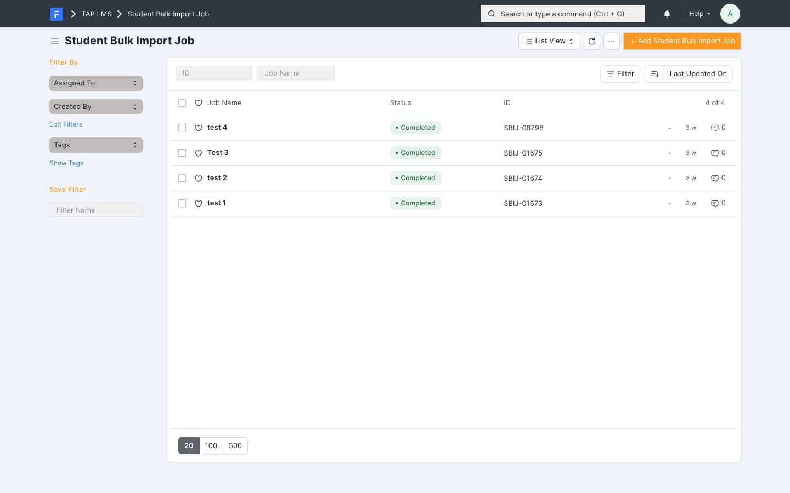
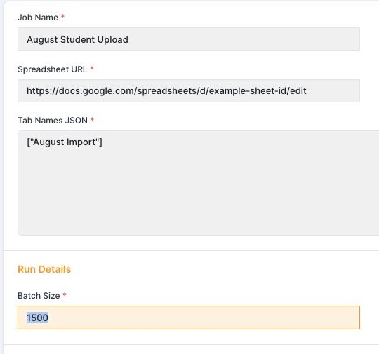
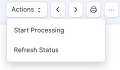
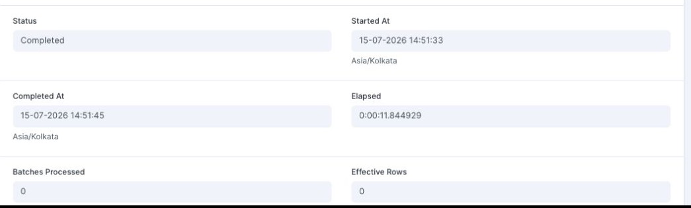
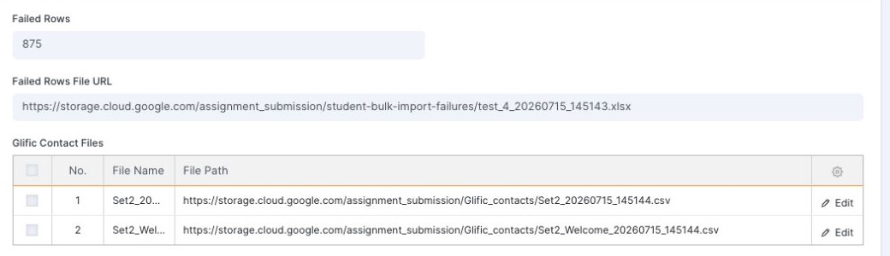

# Student Bulk Import Job User Guide

This guide explains how to upload student data in bulk using the **Student Bulk Import Job** process in LMS.

Use this process when you have student rows in a Google Sheet and want LMS to create new students, update existing students, and create student enrollment rows from the sheet.

## What this process does

For every non-empty row in the selected sheet tabs, LMS checks whether the student already exists by phone number.

- If the phone number matches an existing student, LMS updates that student.
- If the phone number does not match an existing student, LMS creates a new student.
- LMS creates a student enrollment for each valid processed row.
- Invalid rows are skipped and written into a failed rows file.
- Glific contact CSV files are generated after the job completes.

## Before you start

### 1. Prepare the Google Sheet

The sheet can have any tab name. The tab name does not decide whether the student is inserted or updated.

The only rule is that the tab name you enter in LMS must exactly match the tab name in the Google Sheet.

Each selected tab must have these exact column headers:

| Column | Required value |
| --- | --- |
| Student Name | Student's name |
| Contact No. | 10 digit Indian phone number, or 12 digit number starting with `91` |
| Gender | `M`, `Male`, `F`, or `Female` |
| School ID | School ID that already exists in LMS |
| Language | Language that already exists in LMS |
| Batch | Batch name or Batch ID that already exists in LMS |
| Grade | Grade from `1` to `12` |
| Course | Course vertical that already exists in LMS |

Blank rows are ignored.

### 2. Share the sheet

Share the Google Sheet with this email address before starting the job:

```text
data-migration@rubrics-data-migration.iam.gserviceaccount.com
```

Viewer access is enough. If the sheet is not shared with this email address, LMS may fail with a private Google Sheet access error.

### 3. Check master data

Before running the job, confirm that these values already exist in LMS:

- School ID
- Batch
- Language
- Course

Rows with missing master data are not imported. They appear in the failed rows file.

## Step 1: Open Student Bulk Import Job

Open:

```text
https://tap-lms.theapprenticeproject.org//app/student-bulk-import-job/view/list
```

You will see the Student Bulk Import Job list page.



## Step 2: Create a new job

Click **Add Student Bulk Import Job**.

Fill these fields:

| Field | What to enter |
| --- | --- |
| Job Name | A clear name for this upload, for example `August Student Upload` |
| Spreadsheet URL | The Google Sheet URL |
| Tab Names JSON | The exact Google Sheet tab names to process |
| Batch Size | Use `1500` |

Example for one tab:

```json
["August Import"]
```

Example for multiple tabs:

```json
["August Import", "September Import"]
```

The tab names can be anything. They must be entered exactly as they appear in the Google Sheet, including spaces and capitalization.



## Step 3: Save the job

Click **Save**.

The job must be saved before processing can start.

## Step 4: Start processing

After saving, open the **Actions** menu and click **Start Processing**.

Do not click this until the sheet URL, tab names, and batch size are correct.



After clicking **Start Processing**, the job status should change to **Queued** and then **Processing**.

## Step 5: Refresh and monitor progress

Use **Actions > Refresh Status** to reload the latest job status.

Watch these fields:

| Field | Meaning |
| --- | --- |
| Status | Current job state: Draft, Queued, Processing, Completed, or Failed |
| Started At | When processing started |
| Completed At | When processing finished |
| Elapsed | Total processing time |
| Batches Processed | Number of batches completed |
| Effective Rows | Number of valid rows processed |
| Failed Rows | Number of invalid rows skipped |



## Step 6: Review the completed job

When the job status is **Completed**, review:

- **Effective Rows**: valid rows that were processed.
- **Failed Rows**: invalid rows that were skipped.
- **Failed Rows File URL**: workbook containing invalid rows and validation errors.
- **Glific Contact Files**: CSV files generated for Glific upload.
- **Summary JSON**: technical summary of the run.
- **Processing Log**: detailed progress log.



## Step 7: Fix failed rows

If **Failed Rows** is greater than `0`:

1. Copy or open the **Failed Rows File URL**.
2. Download the failed rows workbook.
3. Check the **Validation Errors** column.
4. Fix the highlighted fields in your source sheet or in a corrected copy.
5. Create a new Student Bulk Import Job for only the corrected failed rows.

Do not rerun the full original sheet unless you intentionally want to process every row again.

Common failed-row reasons:

| Error type | What to check |
| --- | --- |
| Invalid Contact No. | Phone number must be 10 digits or 12 digits starting with `91` |
| Duplicate Contact No. | The same phone appears more than once in the selected tabs |
| Invalid Grade | Grade must map to a supported level |
| School ID not found | School does not exist in LMS |
| Batch not found | Batch does not exist in LMS |
| Language not found | Language does not exist in LMS |
| Course not found | Course does not exist in LMS |

## Step 8: Use Glific contact files

After the job completes, LMS creates Glific contact CSV files in the **Glific Contact Files** table.

For each row:

- **File Name** shows the generated CSV file.
- **File Path** gives the file URL.
- Use the CSV file for the next Glific contact upload step.

## Step 9: Upload Glific contact files

1. For new students, create a collection in Glific first with the tab name and then go to Manage -> Contacts -> Import Contacts.

2. For old students, go to  Manage -> Contacts -> Move contacts. 

Make sure the jobs to create/update contacts complete successfully without erros. 


## If the job fails

If the status becomes **Failed**:

1. Open the job.
2. Check **Last Error**.
3. Check **Processing Log**.
4. Fix the cause.
5. Create or restart a corrected job.

Common failure causes:

- The Google Sheet was not shared with `data-migration@rubrics-data-migration.iam.gserviceaccount.com`.
- The Spreadsheet URL is wrong.
- A tab listed in **Tab Names JSON** does not exist in the sheet.
- A selected tab is missing required column headers.
- LMS cannot access Google Drive.

## Final checklist

Before starting the job, confirm:

- The Google Sheet is shared with `data-migration@rubrics-data-migration.iam.gserviceaccount.com`.
- Every selected tab has the required columns.
- **Tab Names JSON** exactly matches the sheet tab names.
- **Batch Size** is set to `1500`.
- School, Batch, Language, and Course values already exist in LMS.
- You have saved the job before clicking **Start Processing**.


